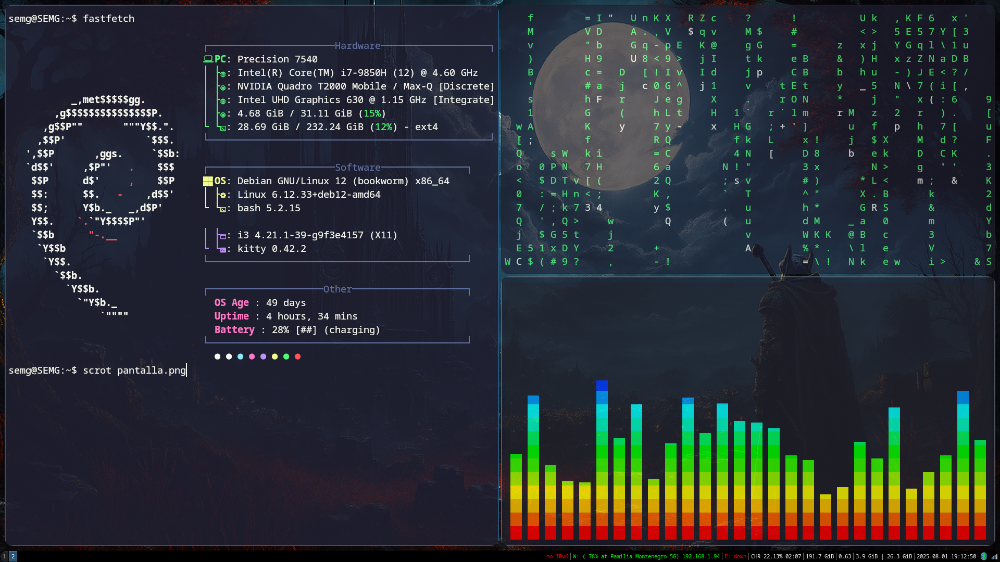

# Dotfiles Programas / Cava / Picom / Kitty / Fastfetch / i3 
 - ### **Picom**: Compositor que permite agregar efectos visuales como sombras, transparencias y animaciones como fades a las ventanas
 - ### **i3**: Manejador de ventanas, en mi opinion es bastante ligero y tiene un sin fin de configuraciones disponibles, ademas que permite la interaccion entre picom
 - ### **Fastfetch**: Es la herramienta que muestra informacion relacionada con nuestro sistema, en github hay demasiadas configuraciones de este mismo.
 - ### **Kitty**: Terminal que estoy utilizando, la terminal no me ha dado problemas unicamente que al inicio estuvo muy lenta, sin embargo luego la actualice y todo mejoro.
 - ### **Cava**: Visualizador de sonido para la terminal de linux
#

### Importante 
Para poder simplificar el proceso de los archivos .config se utilizo la herramienta "GNU STOW" que entre tantas posibilidades, 
nos da la oportunidad de crear enlaces simbolicos (symlinks), estos actuan como punteros (documento_real) -> (documento_simbolico)
Esto permitio que cuando se actualice el documento original ubicado en la carpeta /home/user/.config/ tambien se actualiza 
el documento de este repositorio. El proceso para usar GNU STOW consistio en: 

1. Crear un directorio
2. Crear carpetas para cada herramienta
3. Replicar la estructura del directorio .config `directorio/i3/.config/i3/config`
4. Crear los documentos .txt necesarios para i3: `config` Entonces la estructura final seria: `.dotfiles/i3/.config/i3/config(documento)`
5. Luego hacemos cd .. hasta llegar a .dotfiles y ahi escribimos `stow -nv i3` Tenemos que ver algo que diga que el archivo que estamos apuntando es un directorio o un documento
6. Luego hacemos `stow --adopt -nv i3` aqui se nos informa que esta a punto de ocurrir que es lo siguiente:  `.config/i3/config` -> `.dotfiles/i3/.config/i3/config`
7. Finalmente hacemos `stow --adopt -v i3` y se linkean los documentos.
8. Repetimos proceso para las demas herramientas.
